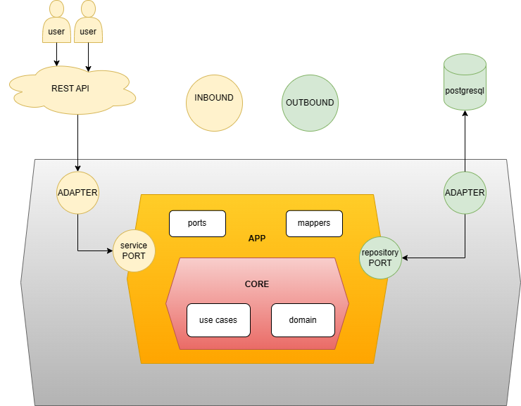
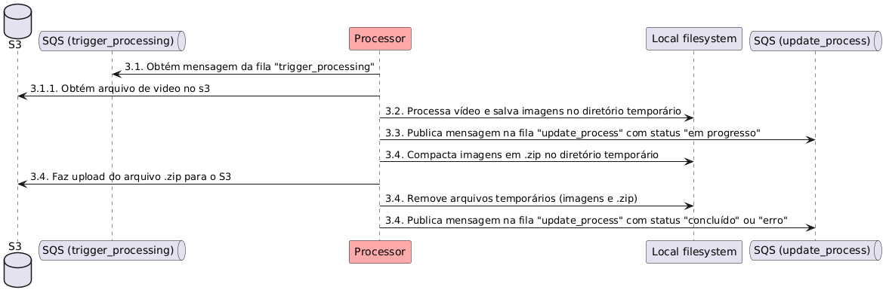

# video-processor

Serviço responsável por converter um vídeo em um conjunto de imagens (frames) e armazenar no S3.

## 🏛👷 Arquitetura

O serviço foi desenvolvido utilizando o padrão de arquitetura hexagonal, onde a pasta/camada `application` é o centro da aplicação e as camadas `infrastructure` e `adapter` são periféricas.

A camada `application` é <strong>agnóstica</strong>, ela depende só de si mesma, portanto ela não se comunica com camadas periféricas, entretanto as camadas periféricas (`infrastructure` e `adapter`) se comunicam com ela.

A camada `adapter` é responsável por fazer a ponte (comunicação) entre o `"mundo externo"` e a camada `application`, portanto para o desenvolvimento deste há dois *"adapters"*: um responsável pela saída (*"OUTBOUND"*) comunicando com o banco de dados postgresql, e outro pela entrada (*"INBOUND"*) que é responsável por expor uma API rest (recebendo requisições HTTP) para consumidores.

Abaixo uma imagem representativa:




## 👷🏃 Como construir e executar local?

O desenvolvimento deste foi feito em cima da plataforma de desenvolvimento kotlin/jvm (com springboot) e banco de dados postgresql para a persistência dos dados, portanto é recomendado as seguintes versões para a execução local:
```
jvm: 21
postgresql: 16
```

### Comando para rodar local (modo debug):
```
$ ./gradlew bootRun -Dspring.profiles.active=local
# (O comando acima roda o projeto no ambiente local)
```

**Nota:** para executação local, é necessario configurar um banco de dados postgresql, portanto recomenda-se o docker para facilitar este processo. O próximo passo explica como executar com docker.


### Para construir e executar com docker:

- Construção:

```$ docker compose up --build```

- Execução (depois de construído):

```$ docker compose up```

--- 

## ⚙️ Executando os testes

Na aplicação existem testes unitários. Para executar os testes unitários execute o comando abaixo:

### 🔩 Testes unitários

Os testes unitários testam as classes individualmente, sem dependências externas. Para executar os testes unitários execute o comando abaixo:

```
./gradlew test
```
---

### Integração com AWS SQS

A aplicação monitora a fila SQS `trigger_processing` e, ao receber uma mensagem, processa o id. 
Se tudo estiver correto, acessa o s3, faz download do video, extrai os frames salvando em imagens num diretorio temporário e depois grava no s3 um arquivo zip com todas imagens.

A aplicação também publica mensagens na fila SQS `update_process` com o status do processamento do vídeo.

**NOTA:** Esta aplicação não expõe nenhuma api REST, e nem possui conexão com o banco de dados, ela apenas processa mensagens da fila SQS supracitada.

---
### Diagrama de sequência contendo a interação entre os componentes



----
## Padrão SAGA Coreografado
O padrão Saga Coreografado é aplicado em projetos de aplicações distribuídas e microserviços para assegurar a consistência em transações que envolvem múltiplos serviços. Nesse contexto, cada serviço participante de uma transação executa uma parte da operação e emite eventos para indicar seu estado. Outros serviços ou um coordenador observam esses eventos e coordenam as operações para garantir que a transação seja concluída com sucesso ou revertida de maneira consistente.

Existem várias vantagens em utilizar o padrão Saga Coreografado em aplicações, como as descritas nos repositórios do projeto "video-processor":

- Consistência distribuída: Como as transações envolvem diversos serviços, é crucial garantir que todos estejam em um estado consistente, mesmo em caso de falhas.
  Escalabilidade e desempenho: O padrão possibilita a distribuição das operações entre vários serviços, melhorando a escalabilidade e o desempenho do sistema.
- Resiliência: Este padrão aumenta a resiliência do sistema a falhas, permitindo que as transações sejam revertidas de forma consistente se um dos serviços falhar.
- Visibilidade e monitoramento: Cada serviço emite eventos para indicar seu estado, facilitando o monitoramento e a detecção de problemas no sistema.
- Flexibilidade e manutenção: O padrão torna o sistema mais flexível, permitindo a adição ou alteração de novos serviços sem modificar a lógica de negócios existente.
- Em resumo, o padrão Saga Coreografado é utilizado em aplicações distribuídas e microserviços para assegurar a consistência e a integridade das transações, mesmo em ambientes distribuídos e de alta escalabilidade.  
